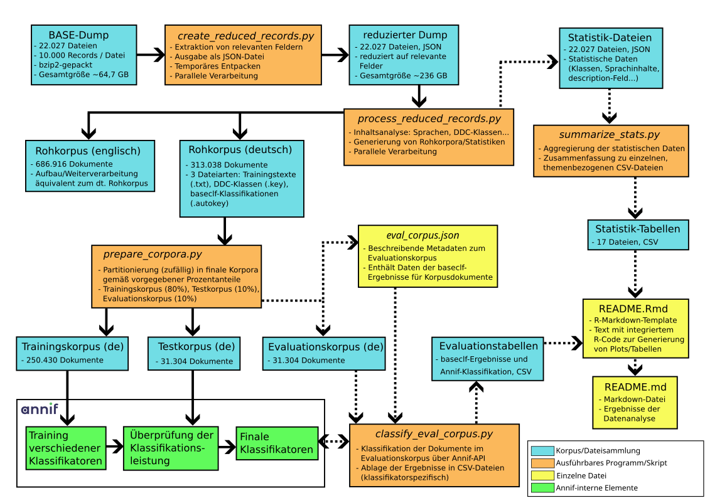

## Übersicht

Dieses Repository enthält die Software, die im Rahmen meiner Masterarbeit "Implementierung einer automatischen DDC-Klassifikation für die Suchmaschine BASE auf Basis von Annif" an der Technischen Hochschule Köln erstellt wurde.
Das Repository enthält als Ausgangspunkt im Verzeichnis `data/base_dump` einen minimalen BASE-Dump, bestehend aus 100.000 Records, hiermit lässt sich der Ablauf der Toolchain nachvollziehen (die Dateien wurden so ausgewählt, dass möglichst viele DDC-Klassen enthalten sind). Erstellt wurde der gesamte Code in einer Linux-Umgebung (Manjaro Linux). Wir geben im Folgenden eine Installationsanleitung für die recht verbreitete Distribution Ubuntu 22.04 LTS. Grundsätzlich sollten alle Programme auch unter anderen Distributionen lauffähig sein, in diesem Fall müssen aber gegebenenfalls andere systemweite Pakete installiert werden. Die Ausführung unter anderen Betriebssystemen wie Windows wurde nicht getestet.

Folgende Übersicht zeigt den Ablauf der entsprechenden Toolchain (Abbildung 5 in der Masterarbeit):



## Vorbereitung

Ausgehend von einem neu aufgesetztem Ubuntu 22.04 LTS müssen zunächst eine Reihe von Paketen installiert werden, dies geschieht über die Kommandozeile mittels:

`sudo apt install git python-is-python3 python3-virtualenv libicu-dev pkg-config libcurl4-openssl-dev libssl-dev libxml2-dev libfontconfig1-dev libharfbuzz-dev libfribidi-dev libfreetype6-dev libpng-dev libtiff5-dev libjpeg-dev r-base-core`

Außerdem muss natürlich noch das Repository selbst heruntergeladen und entpackt oder mittels `git clone` geklont werden.

## Anlegen der virtuelle Umgebungen/Annif-Installation

Es werden zwei virtuelle Umgebungen (virtual environments) angelegt: Eine für den verarbeitenden Code der Toolchain und eine, die Annif enthält. Ausgehend vom Wurzelverzeichnis des Repositorys geschieht dies folgendermaßen:

```
cd code
virtualenv venv
source venv/bin/activate
python -m pip install --upgrade pip setuptools wheel
pip install -r requirements.txt
deactivate
```

```
cd ../annif
virtualenv annif-venv
source annif-venv/bin/activate
python -m pip install --upgrade pip setuptools wheel
pip install -r requirements.txt
```

Damit ist Annif bereits installiert. Es müssen nun noch einige Zusatzpakete für die verwendeten Backends und den linguistischen Präprozessor heruntergeladen werden: 

```
python -m nltk.downloader punkt
pip install annif[fasttext]
pip install annif[omikuji]
pip install annif[nn]
```

**Anmerkung zu den virtuellen Umgebungen**: Üblicherweise wird links vom Eingabeprompt angezeigt, welche Umgebung gerade aktiv ist, beispielsweise `(annif-venv)`. Diese muss umgeschaltet werden, falls das jeweils andere System bedient werden soll, dies geschieht durch erneute Eingabe des jeweiligen `source`-Befehls. Momentan befinden wir uns in der Annif-Umgebung `(annif-venv)`, um wieder auf die Toolchain-Umgebung umzuschalten, müssten wir wieder ins `code`-Verzeichnis wechseln und dort `source venv/bin/activate` ausführen. Alternativ ist es auch möglich, eine zweite Kommandozeile zu öffnen und dort die jeweils andere virtuelle Umgebung offen zu halten. 

## Korpusaufbereitung

Wir wechseln zunächst wieder ins `code`-Verzeichnis und aktivieren die Toolchain-Umgebung:

```
cd ../code
source venv/bin/activate
```

Jetzt sind wir bereit, den beiliegenden Testkorpus verarbeiten:

`python create_reduced_records.py`

Dies erzeugt aus dem BASE-Dump die erwähnten reduzierten Darstellungen im JSON-Format, diese finden sich anschließend im Verzeichnis `data/reducedListRecords`.

`python process_reduced_records.py -C -S -a -r`

Hiermit werden die Rohkorpora (`-C`) und Statistiken (`-S`) erzeugt, diese finden sich anschließend in den Verzeichnissen `data/corpus` bzw. `data/stats`. Bei der Erstellung der Korpora verwenden wir die zusätzlichen DDC-Informationen aus `dc:subject` (`-a`) und fordern, dass der Spracherkenner polyglot nur zuverlässige ("reliable") Ergebnisse verwendet (`-r`). Das Skript kennt noch weitere Möglichkeiten zur Parametrisierung, diese entsprechen in der Standardeinstellung allerdings genau den Werten, die in der Masterarbeit verwendet wurden.

`python prepare_corpora.py -D -E`

Hiermit werden die deutschen (`-D`) und englischen (`-E`) finalen Korpora erzeugt (test, train und eval), die relativen Größen entsprechen in der Standardeinstellung denjenigen in der Masterarbeit (80%/10%/10%). Die Korpora finden sich nach Abschluss im Verzeichnis `data/prepared_corpora`.

## Annif-Training

Mit den finalisierten Korpora können wir nun die Klassifikatoren in Annif trainieren. Zunächst wechseln dazu wieder ins `annif`-Verzeichnis und aktivieren die entsprechende Umgebung:

```
cd ../annif
source annif-venv/bin/activate
```

Damit steht uns auf der Kommandozeile der Befehl `annif` zur Verfügung.

`annif list-projects`

Es werden die vorab definierten Klassifikatoren, die auch in der Masterarbeit analysiert wurden, angezeigt, zur Zeit sind alle noch untrainiert.

```
annif load-vocab en_ddc ../code/en_ddc.tsv -L en
annif load-vocab en_ddc_for_de ../code/en_ddc.tsv -L de
```

Hiermit werden die benötigten DDC-Vokabulare in Annif geladen, wir verwenden für beide Sprachen aus Gründen der Vergleichbarkeit die englischen Klassennamen. Nun können alle Backends unter Verwendung des gleichsprachigen Trainingskorpus trainiert werden. Wichtig ist dabei nur, dass das jeweilige `nn_ensemble` zuletzt trainiert wird, da es auf den drei anderen Klassifikatoren basiert:

```
annif train de-tfidf ../data/prepared_corpora/de/train
annif train de-omikuji ../data/prepared_corpora/de/train
annif train de-fasttext ../data/prepared_corpora/de/train
annif train de-nn_ensemble ../data/prepared_corpora/de/train

annif train en-tfidf ../data/prepared_corpora/en/train
annif train en-omikuji ../data/prepared_corpora/en/train
annif train en-fasttext ../data/prepared_corpora/en/train
annif train en-nn_ensemble ../data/prepared_corpora/en/train
```

Anschließend können die Backends wahlweise evaluiert werden, dies geschieht unter Verwendung des gleichsprachigen Testkorpus. Der folgende Befehl evaluiert beispielsweise das deutschsprachige Omikuji-Backend, dabei müssen die in der Masterarbeit diskutierten Parameter limit (`-l`) und threshold (`-t`) vorgegeben werden:

`annif eval de-omikuji -l 2 -t 0.1 ../data/prepared_corpora/de/test`

Annif kann auch als Webdienst gestartet werden, um die trainierten Klassifikatoren "live" auszuprobieren. Hierzu muss einfach der Befehl `annif run` eingegeben werden, dass System startet anschließend einen Webserver auf der lokalen Maschine (üblicherweise unter `http://127.0.0.1:5000`), die entsprechende Adresse kann dann ganz regulär in einem Browser geöffnet werden. 
Während Annif als Webdienst läuft, kann auch die Auswertung auf dem Evaluationskorpus gestartet werden. Hierzu muss (auf einer zweiten Kommandozeile) zunächst wieder die Toolkit-Umgebung aktiviert werden:

```
cd code
source venv/bin/activate
```

Anschließend kann die Evaluation gestartet werden, wobei der gerade laufende Annif-Server angefragt wird. Der folgende Befehl evaluiert beispielsweise den deutschsprachigen Omikuji-Klassifikator mit einem limit von 2 und einem einem threshold von 0.1. Die Angabe `-c de` gibt die verwendete Sprache an und selektiert dadurch automatisch den korrekten Evaluationskorpus.

`python classify_eval_corpus.py -l 2 -t 0.1 -c de de-omikuji`

Nach dem Durchlauf werden einige Statistiken angezeigt, zusätzlich wird eine Ergebnisdatei generiert.

## Statistiken

Optional kann auch die Erstellung der in der Masterarbeit verwendeten Diagramme und Tabellen nachvollzogen werden. Hierzu müssen allerdings zunächst einige zusätzliche Bibliotheken für die Programmiersprache `R` systemweit installiert werden:

`sudo R -e "(install.packages(c('knitr', 'tidyverse', 'ggplot2', 'ggrepel')))"`

Zunächst generieren wir die benötigten Tabellen aus unseren zuvor gewonnenen Statistik-Dateien. Anschließend wechseln wir ins `analyze`-Verzeichnis, wo wir mithilfe von `R` und `knitr` aus der Rmd-Vorlage eine lesbare Markdown-Datei generieren:

```
python summarize_stats.py
cd ../analyze/
R -e "knitr::knit('README.Rmd')"
```

Das Ergebnis ist eine `md`-Datei im GitHub-eigenen Markdown-Dialekt. Um sie lokal zu betrachten, empfiehlt sich das Python-Modul `grip` (https://pypi.org/project/grip/), das wir zusätzlich in unserer virtuellen Umgebung installieren können:

`pip install grip`

Danach öffnet ein Aufruf von `grip` einen lokalen Webserver (ähnlich wie bei Annif) und wir können die Datei im Browser betrachten, wichtig ist dabei lediglich, dass der Aufruf aus dem `analyze`-Verzeichnis heraus gestartet wird.
